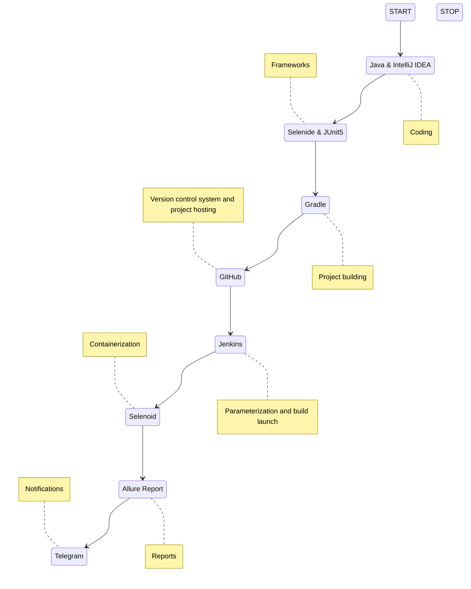
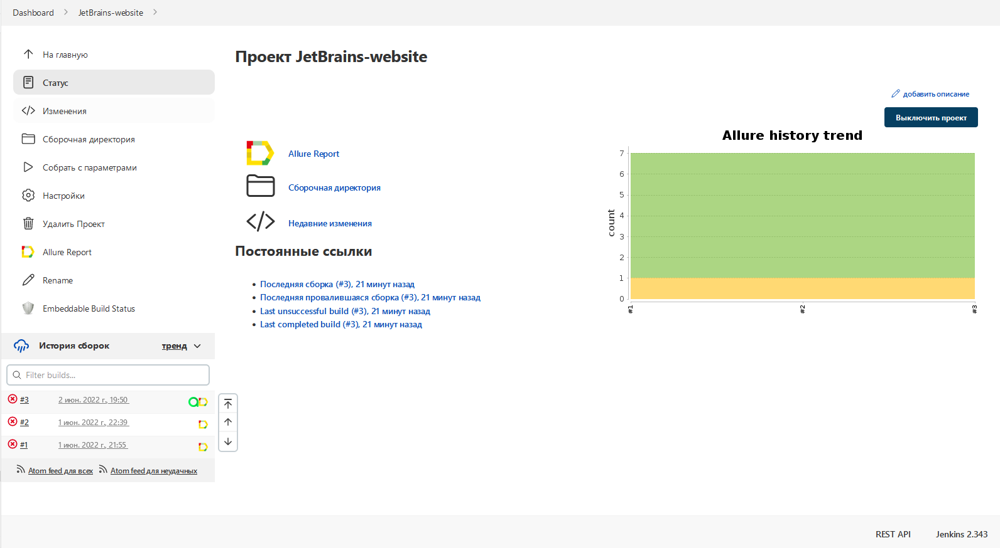
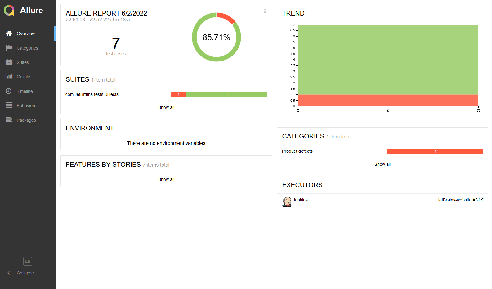
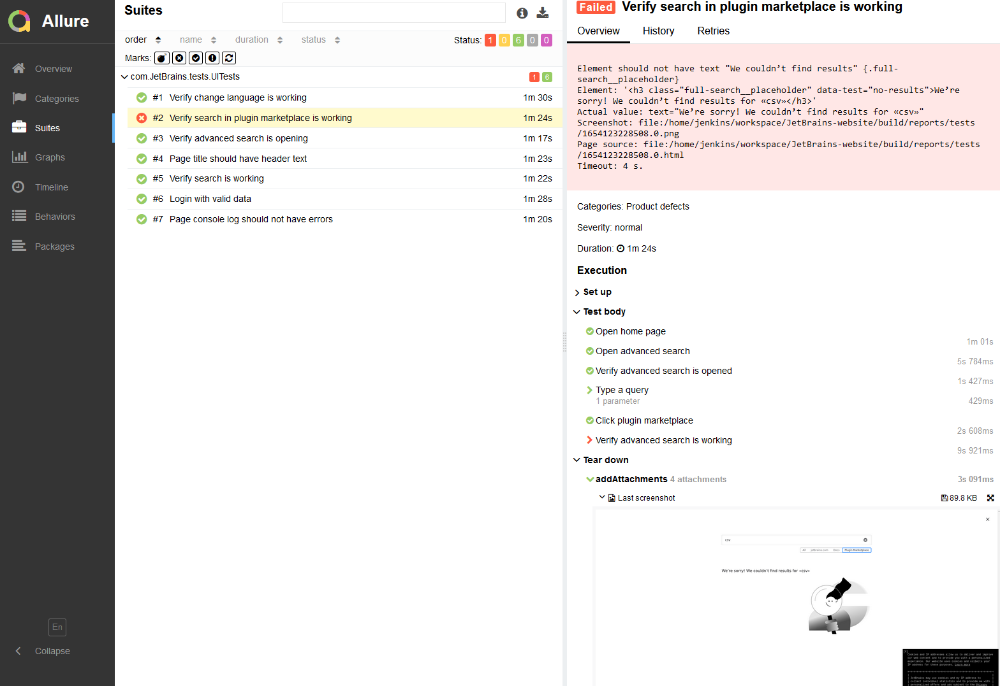
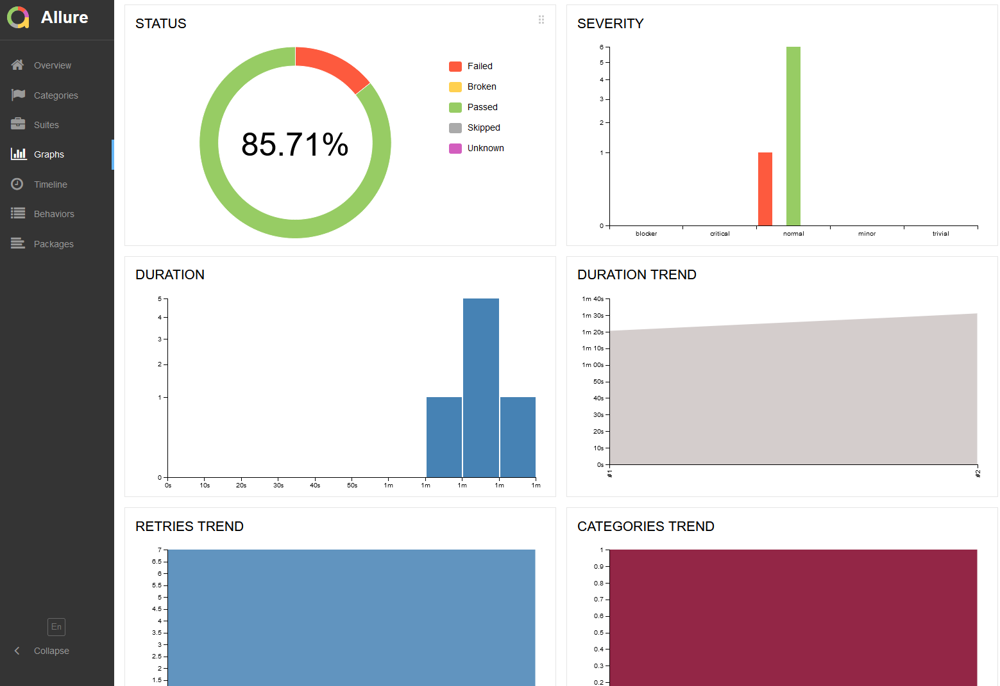
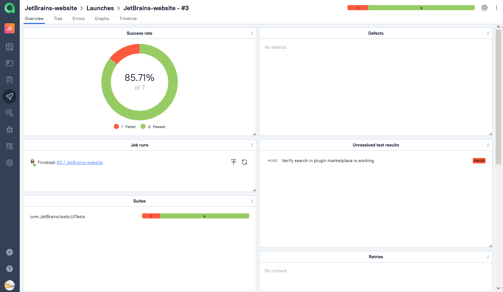
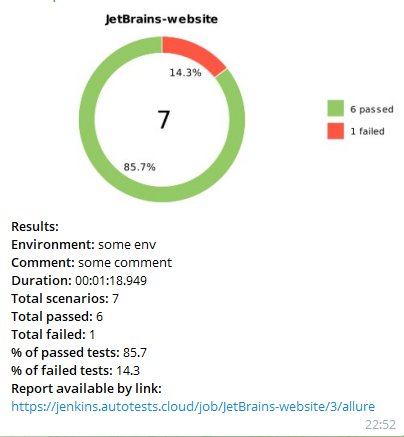
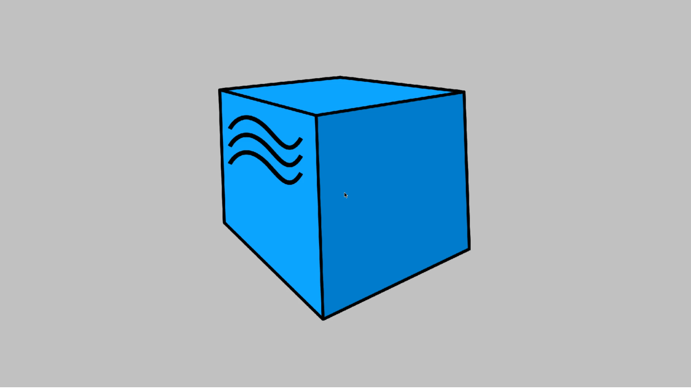

# Autotests for JetBrains website

## :page_with_curl:    Content

➠ [Tests](#globe_with_meridians-tests)

➠ [Technology stack](#computer-Technology-stack)

➠ [Running tests from the terminal](#technologist-Running-tests-from-terminal)

➠ [Run tests on remote selenoid server](#Run-tests-on-remote-selenoid-server)

➠ [The project on Jenkins](#-The-project-on-Jenkins)

➠ [Test results report in Allure Report](#-Test-results-report-in-Allure-Report)

➠ [Integration with Allure TestOps](#-Integration-with-allure-testops)

➠ [Notifications in Telegram using a bot](#-Notifications-in-Telegram-using-a-bot)

➠ [Пример запуска теста в Selenoid](#-пример-запуска-теста-в-selenoid)

## <a name="globe_with_meridians-tests"></a>:globe_with_meridians: Tests

- [x] Checking for errors in the home page console log
- [x] Page title should have header text
- [x] Login with valid credentials
- [x] Verify search is working
- [x] Verify advanced search is opening
- [x] Verify search in plugin marketplace is working
- [x] Verify change language is working

## :computer: Technology stack

<p align="center">


</p>



## :technologist: Running tests from the terminal

### Local test run

```
gradle clean test
```

### Run tests on remote selenoid server

```
gradle clean test -Dconfig=RemoteConfig
```

### Additional build parameters you could use 

> <code>REMOTE_DRIVER_URL</code> – адрес удаленного сервера, на котором будут запускаться тесты.
>
> <code>-Dbrowser</code> – to change browser, by default it's Chrome. 
>
> <code>-DbrowserVersion</code> – to change browser version, by default it's the last available.
>
> <code>-DbrowserSize</code> – to change browser size, by default it's 1920x1080.
>
> <code>-DbaseUrl</code> – to change base url for the tests, by default it's https://www.jetbrains.com/
>
> <code>-DselenoidUrl</code> – to change selenoid server on which the tests are going to run.

##  The project on [Jenkins](https://jenkins.autotests.cloud/job/JetBrains-website/)

<p align="center">
  
</p>

##  Test results report in [Allure Report](https://jenkins.autotests.cloud/job/JetBrains-website/allure/)

### :pushpin: Allure report main page

<p align="center">

</p>

### :pushpin: The test suite

<p align="center">

</p>

### :pushpin: Dashboard

<p align="center">

</p>

##  Integration with [Allure TestOps](https://allure.autotests.cloud/launch/13201)

<p align="center">
  
</p>

##  Notifications in Telegram using a bot

> When the build is complete, the bot created in Telegram automatically sends a message with a report (instead of Telegram notifications can be sent to Slack or email).
<p align="center">

</p>

##  Пример запуска теста в Selenoid

> Each test in the report is accompanied by a video. One such video is shown below.
<p align="center">
  
</p>